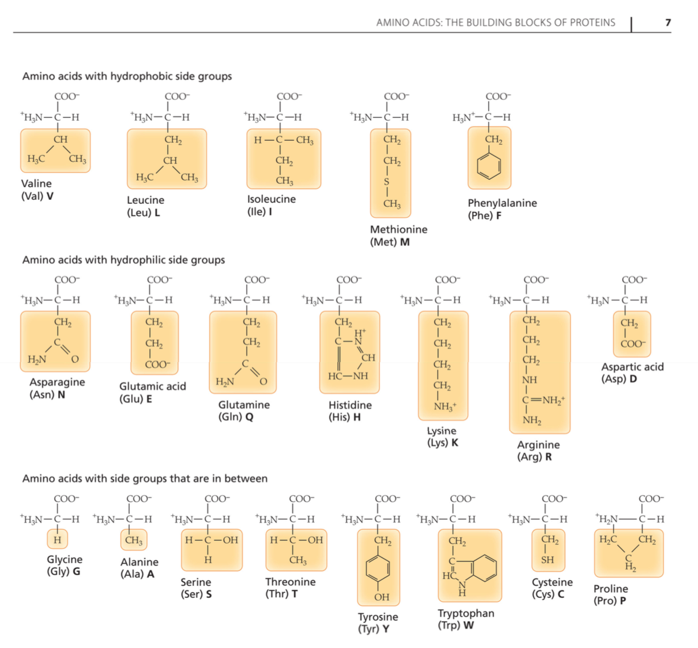
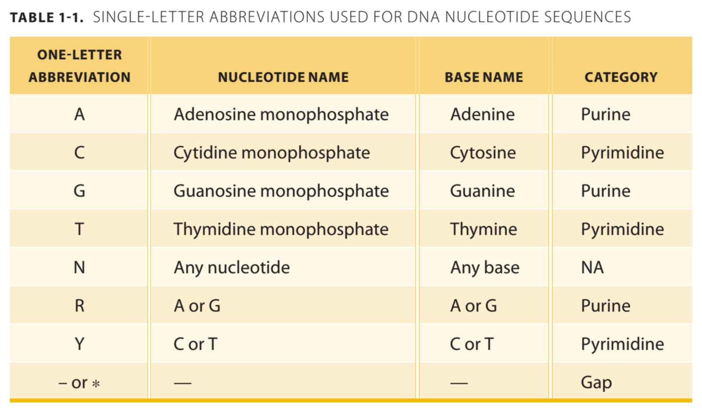

```{r setup, include=FALSE}

knitr::opts_chunk$set(fig.width = 7, fig.height = 3, echo = FALSE) 

library(dplyr)
library(tidyr)
library(magrittr)

```

# Assignment 1

## 1.1

Some text and equation here: 

\begin{equation}
  S = \sqrt{\frac{\sum_{r,s}(d_{rs} - \hat{d}_{rs})^2}{\sum_{r,s} d_{rs}^2}}.
\end{equation}


```{r}
# ------------------------------------------------------------------------------
# Question 1.1
# ------------------------------------------------------------------------------

```

## 1.2

```{r}
# ------------------------------------------------------------------------------
# Question 1.2
# ------------------------------------------------------------------------------

```

# Assignment 2

Note that, by convention, a *coding strand* is used when displaying a DNA sequence.
"A coding strand, is the segment within double-stranded DNA that runs from 5' to 3', and which is complementary to the antisense strand of DNA, or template strand, which runs from 3' to 5'" (https://en.wikipedia.org/wiki/Sense_strand).

## 2.1

We go to the following link https://www.ncbi.nlm.nih.gov/nuccore/CU329670, 
scroll down to "Features", click on "CDS" to see the first 5662 nucleotides of 
the sequence.

The protein product is: **RecQ type DNA helicase**

## 2.2

Note that proteins are made up of 20 different amino acids (linked together).
Amino acids are molecules composed of an alpha carbon, a carboxyl group, an
amino group and a side chain. The side chain is what makes an amino acid unique
(see p. 5, Concepts in Bioinformatics and Genomics). The 20 different amino
acids can be found in the picture below.

In our case, the first four amino acids are:

1. M (= **Methionine**, coded by ATG, representing the starting sequence)
2. V (= **Valine**)
3. V (= **Valine**)
4. A (= **Alanine**)

```{r, out.width = "400px"}

```

## 2.3

Note that nucleotides code for amino acids. They are molecules composed of a sugar, a phosphate and a base. The part of nucleotides that distinguishes them is the base.

There are four possible bases: A (Adenine), C (Cytosine), G (Guanine), T (Thymine)

```{r, out.width = "300px"}

```

Specific combinations of these nucleotides code for specific amino acids. In 
genetic code, three nucleotides (called codon) always code for one amino acid.
E.g. ATG codes for met (Methionine) which is a starting point of a protein. 
Which codos code for which amino acids is shown in the overview below:

```{r, out.width = "400px"}
knitr::include_graphics("images/2.3_codons-aminoacids")
```


*Saving the nucleotide sequence from GenBank:*

The complete nucleotide sequence of the coding strand from GenBank 
(https://www.ncbi.nlm.nih.gov/nuccore/CU329670.1?from=1&to=5662) was saved 
in FASTA format as **2.3_nucleotid-sequence.FASTA**. Note that only the last 12 characters AGCGACGACCAT actually correspond to the amino acids MVVA if the
reverse compliment is taken (see 2.4).

*Using backtrack to obtain the amino acid sequence from the protein sequence:*

We used backtrack to obtain the amino acid sequence corresponding to the protein
sequence `MVVA` (https://www.ebi.ac.uk/Tools/st/emboss_backtranseq/). After pasting 
`MVVA` and selecting "Schizosaccharomyces pombe (CAI equivalent)", the following 
sequence is returned: **ATGGTCGTCGCT**


## 2.4

The above mentioned obtained coding strand sequence ATGGTCGTCGCT does not exist 
in the provided nucleotide sequence (that was saved in FASTA format as 
2.3_nucleotid-sequence.FASTA) since this sequence is not found when searching
the file.

*Option 1*

However, we can modify the displayed sequence to get what we are looking for.
On GenBank, under "Display options", one has to select both "Show sequence" and 
**"Show reverse complement"** (https://www.ncbi.nlm.nih.gov/nuccore/CU329670.1?from=1&to=5662). 
Afterwards, the displayed nucleotid sequence under "ORIGIN" starts with ATGGTCGTCGCT 
which codes for our amino acids MVVA.

*Option 2*

Alternatively, one can take the last 12 characters from the original nucleotid 
sequence (the one in the FASTA file, i.e. the sequence before selecting
"Show reverse complement" on GenBank). These characters are: AGCGACGACCAT. 
Copy this string and paste it here: http://arep.med.harvard.edu/labgc/adnan/projects/Utilities/revcomp.html
Then click **"reverse complement"**. The result is again the sequence that we 
are looking for: ATGGTCGTCGCT which codes for our amino acids MVVA.

*Conclusion*

**ATGGTCGTCGCT is exactly what we got in 2.3 using backtranseq** to obtain the 
amino acid sequence from the protein sequence `MVVA`. The only tricky thing here
was that we needed to take the reverse complement of the correct characters
from the nucleotid sequence (namely the last 12 characters).


## 2.5

*Number range that corresponds to these amino acids (protein sequence):*

In the saved FASTA file, the *last 12 characters* AGCGACGACCAT correspond to the 
amino acids MVVA (after taking the reverse complement). The number range 
corresponding to them is 5651 to 5662.

If we had selected "Show reverse complement" on GenBank before, then the 
*first 12 characters* ATGGTCGTCGCT would correspond to the amino acids MVVA. The
number range would then be 1 to 12.

*Stop codon in the nucleotide sequence:*

Note that there are three possible stop codons: TAA, TAG, TGA. Still, it is not
easy to identify the stop codon manually. However, one can use: 
https://www.ncbi.nlm.nih.gov/orffinder and paste the complete (reverse complement) 
nucleotide sequence in FASTA format. With the default parameters, this is 
automatically translated to the correct amino acid sequence. Also, after 
scolling down a bit, one can see that the last stop happens at 5661. 
We find TC from 5661 to 5662 (and at 5662, we have the last nucleotid).
From 5658 to 5660, we have TGA which is one of the above mentioned stop codons.
We can conclude that the stop codon in the nucleotid sequence is hence TGA 
from 5658 to 5660 (looking at the reverse complement nucleotid sequence).

*Chromosome on which the genomic sequence lies:*

We can see on GenBank (in the header under the definition as well as in the 
features under source), that this genomic sequence lies on the chromosome 1 
of schizosaccharomyces pombe.


# Assignment 3

## 3.1

```{r}
# ------------------------------------------------------------------------------
# Question 3.1
# ------------------------------------------------------------------------------

```

## 3.2

```{r}
# ------------------------------------------------------------------------------
# Question 3.2
# ------------------------------------------------------------------------------

```

# Appendix

```{r, ref.label = knitr::all_labels(), echo = TRUE, eval = FALSE}

```