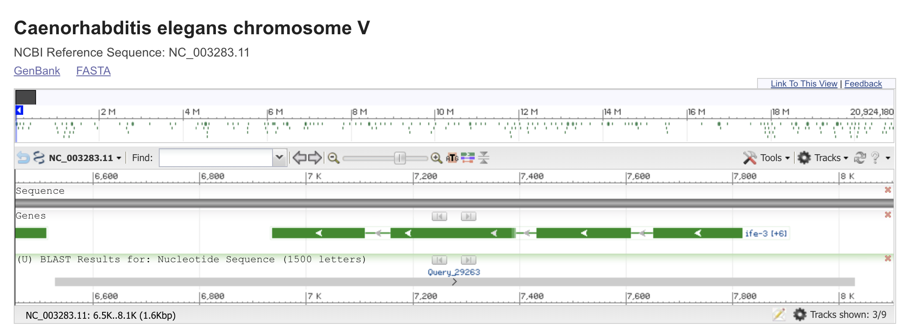

```{r setup, include=FALSE, echo = FALSE}
# These uncommented lines can be used to install the BiocManager which enables you to install Biostringss
#if (!requireNamespace("BiocManager", quietly = TRUE))
#    install.packages("BiocManager")
#library("BiocManager")
#BiocManager::install("Biostrings", version = "3.8")
library("Biostrings")
knitr::opts_chunk$set(collapse = TRUE, fig.width = 8)
```

## Question 1: Hardy-Weinberg equilibrium
For this answer we also refer to some insights we got from <https://www2.palomar.edu/anthro/synthetic/synth_2.htm>.

### Question 1.1
By definition we say that p is the proportion of As and q is the proportion of as in a population. From that follows that $p + q= 1$ as also given in the exercise.

We define $P(A) = p$ as $P(A)$ is the probability of an allele being A. Likewise we define $P(a) = q$.

From both insight follows that

$$P(A) + P(a) = p + q = 1$$
Now by taking random samples by mating, we can receive the following combinations $P(A, A)$, $P(A, a)$, $P(a, A)$ or $P(a, a)$. Their sum must add up to 1.

We know that $P(A, A) = P(A) * P(A) = p^2$ and we also know, that $P(a, a) = P(a) * P(a) = q^2$.

For $P(A, a)$ we can state that $P(A, a) = P(A) * P(a) + P(a) * P(A) = 2 * P(A) * P(a) = 2 * p * q$ as the order of the allels doesn't matter.

So if we add up all random mating samples, we get
$$p^2 + q^2 + 2 * p * q = (p + q)^2 = 1$$

Proportion of A
$A$ in $AA(p^2)$ and $Aa(2pq)$
$$p^2 + 2pq/2 = p^2 + pq = p(p+q) = p * 1 = p$$

Proportion of a
$a$ in $aa(q^2)$ and $Aa(2pq)$
$$q^2 + 2pq/2 = q^2 + pq = q(p+q) = q * 1 = q$$
From that we see, that the Hardy-Weinberg equilibrium is attained.

So the proportion of A is p and the proportion of a is q.

Deriving from that we see, that the Hardy-Weinberg equilibrium will not deviate.

### Question 1.2
$H_0$:population is in Hardy-Weinberg equilibrium

$H_1$:population is not in Hardy-Weinberg equilbrium

```{r echo = FALSE}
# Parameters
n = 1000
mm = 357
mn = 485
nn = 158

# From the Hardy-Weinberg equilibirum equations
p = (mm + 0.5 * mn) / n
q = (nn + 0.5 * mn) / n

# Help variables
p_squared = p * p
q_squared = q * q
pq_two = 2 * p * q

expected = c(p_squared, q_squared, pq_two)
observed = c(mm/n, nn/n, mn/n)

cat("Calculated p and q for the given population:", p, q)
cat("Expected:", expected)
cat("Observed:", observed)

chisq.test(expected, p = observed)
```

P-value is bigger than 0.05 (or 0.01) so we cannot reject the null hypothesis. So we can say the population is in Hardy-Weinberg equilibrium.

## Question 2: Exploring a genomic sequence

### Question 2.1
The name is: "RecQ type DNA helicase"

### Question 2.2
The first four amino acids are: MVVA

### Question 2.3 
The CDS looks like this:

```{r, echo=FALSE}
sequence = readDNAStringSet("sequences/schizosaccharomyces_pombe.fasta", format = "fasta")
print(sequence)
```

### Question 2.4
Compare your obtained coding strand sequence with the nucleotide sequence provided

```{r, echo=FALSE}
sequence_cds = readDNAStringSet("sequences/schizosaccharomyces_pombe_obtained.fasta", format = "fasta")
print(sequence_cds)
```

They do not look the same. We can take the complement and reverse them. Then it looks like this: 

```{r, echo=FALSE}
sequence_rvcomp = reverseComplement(sequence)
print(sequence_rvcomp)
```

After taking the complement and the reverse we can see that they still look a little bit different, but they code for the same amino acid. This is due to the fact that mumtiple codes (codons) code the same amino acid.

### Question 2.5
The nucleotide number range is: 1 to 12

The first stop is at position:   

```{r, echo=TRUE}
sequence_char<-as.character(sequence)

#Splitting the chain into sequence of three letters.
split_3letters<-sub("\\s+$", "", gsub('(.{3})', '\\1 ', sequence_char))
#Making sure the split is on right place.
pre_split_vec<-gsub(" ","/", split_3letters)
# Split 
amino_vec<-strsplit(pre_split_vec,"/")
# Making it an vector.
amino_vec<-unlist(amino_vec[[1]])
# Looking for the stops!
Stop<-which(amino_vec=="TAG" | amino_vec=="TAA" | amino_vec=="TGA")
print(Stop[1])

```
The sequence is in Chromosome one.

## Question 3: Exploring a genomic sequence

### Question 3.1
Referring to <https://en.wikipedia.org/wiki/Caenorhabditis_elegans>, <http://www.biology-pages.info/C/Caen.elegans.html> and <https://cbs.umn.edu/cgc/what-c-elegans>.

The Caenorhabditis Elegans is a transparent nematode (roundworm). It was first discovered in 1900 and has been widely used in research since then. The reason for that is, that it is the first multicellular organism, where the whole genome has been mapped. In 1998 the whole sequence has been mapped, still including some missing entries which has been filled in 2002. The neurons of Caenorhabditis Elegans and humans are identical to some degree so it a good organism to perform research on. So it has become some kind of model organism in biology. Additional reasons for that are that it's lifespan can be well estimated, it reproduces rapidly and the signs of aging can be observed. "The development and function of this diploid organism is encoded by an estimated 17,800 distinct genes." (https://cbs.umn.edu/cgc/what-c-elegans).

### Question 3.2
The sequence is the following:

```{r, echo=FALSE}
celegans = readDNAStringSet("sequences/732A51_BioinformaticsHT2018_Lab01Ex03.fasta", format = "fasta")
print(celegans)
```

We get two hits with 100% query cover:

- Select seq LK927634.1	Caenorhabditis elegans genome assembly C_elegans_Bristol_N2_v1_5_4, scaffold CELN2_scaffold0000094
- Select seq FO080176.2	Caenorhabditis elegans Cosmid B0348, complete sequence

As the "Genome Data Viewer" button is only available for the latter one, we choose this one.



## Question 3.3
The genomic sequence does not progress in the same direction as the query as shown in the previous picture above.
If we we take reverse complement, we can see, that the now progress in the same direction:


Furthermore, if we compare both uploaded sequences in the feature section we can see, the for the reverse complement version the Stand changes from "Plus/Plus" to "Plus/Minus" and the displayed range is reversed (instead from 1500 to 2999 it goes from 2999 to 1500). Apart from that the result is (as expected) the same, the coverage, length and number of matches do not differ.

## Question 3.4
It's found here:
Caenorhabditis elegans chromosome V.

## Question 3.5
Searching for the sequence in the given fasta file shows us the exons:


From the previous pictures we can see, that there are four exons. Let's write them down (we copy pasted them from the windows we pictured above).

```{r, echo=FALSE}
exon_1 = DNAString("ATGCGTACCGACGTGGGTTCTATTCCATTAATGTGTATTCTGTCTACACTAACGACTGGTGTGTTCGGATATCTTCCGACAGAAGATCTCACAAATTCGATAATTTCTGGAAACGGTGGTTATCCAGTTCCTCCGGACACTATTATACCGGCCGATGGAGATGAGGAAG")
exon_1_amino = AAString("MRTDVGSIPLMCILSTLTTGVFGYLPTEDLTNSIISGNGGYPVPPDTIIPADGDEE")
exon_2 = DNAString("GTTCCCCAGACGAAGAATCCGACGTTGATTCCGGTGATTCAATTTATCGAAAGAAAGTCACCACATTCCGACGACGAAACATAAATGCCCCATTCGGAGTTCGTGTTCCTTTCAGTAGAATGGCCTATAAAGCCGGTTATGGATCAAACAGAATGGGCTATCGGAACACGGGATCCCCGCCACCCCCACAAATAGGTGGCCTCTACGGTGACCGTAATCCGAATCCATATGGCACAGTGAATCTTGGTGGAGGTTCCCCATATCCTGGGGGTCTAGAAGAGTACAATATCCGGCCGGCCGCTCCATTTTCCGGACTGGTCGGAGGAAGTCGATCTGGGTACTACGGGAGCACTGTTGGTATGAGACGGGGTGCCGTTGTGCCGCCTATGAGCTCCAGGAAGACGAAAATTCCACAGACTGAGTATCCACCTGATTACGCATCTAACGACCTGATGAACAGTTTCAATGGAGCTACAAATTCCGCGATCCCATCACTTCGCGAGCTTGCCACCTATGCGTCACGCTATGGTCCCGCATATCTTCGCGAACGATTCGGAAGCCATGATTCCCAACTTGAGCGTATGCTTTATGGCGGCAGTGGACCACAGATCCCATCACGTGGAGGAGGAATTCCCATAGATTACAACATGAACATTGCTTCGAATCACTGGAACCGAGGAATTGGCTCTCCGATGGGAATTATGTCGCGGGATGTTGATTCCTATCAACACGACGATGCGGCCAAAGCAAACAAAAAGACCACTACCGGCTCGCCGAGCACGACGAGCACACGGAAACCTCGGAAAGCTAGGAAGCCAACCAAGAAGACTGTTGCCGCAGCTCCTTCGTCTAGCTCGAACACATCGACTACGGCAAAGCCTGCAAAAACTGTAAAGACATCGGAGAAGTCTGCCTGA")
exon_2_amino = AAString("GSPDEESDVDSGDSIYRKKVTTFRRRNINAPFGVRVPFSRMAYKAGYGSNRMGYRNTGSPPPPQIGGLYGDRNPNPYGTVNLGGGSPYPGGLEEYNIRPAAPFSGLVGGSRSGYYGSTVGMRRGAVVPPMSSRKTKIPQTEYPPDYASNDLMNSFNGATNSAIPSLRELATYASRYGPAYLRERFGSHDSQLERMLYGGSGPQIPSRGGGIPIDYNMNIASNHWNRGIGSPMGIMSRDVDSYQHDDAAKANKKTTTGSPSTTSTRKPRKARKPTKKTVAAAPSSSSNTSTTAKPAKTVKTSEKSA*")
exon_3 = DNAString("TTAAGGAGTTGGGGTGGCTGGAGAAGTTCCTGTAGCCTCCGTGCCGGGATTCGATGGAGAAGTCGTTGCGGCTGGTCCCTTTTCCTTCACTGGTGCTGGATCCTTGGCTGGAAGACATATGCGTGGCTTGACAGTCGATGAGGTGCGAGCCGACGAGTCCTTGTGAACTTCGTATCTCAAAATCTCAGTATCCGGAATGCTCAATTTCTGCTTCAAAACCTGTCCGATGCGAAGATTGACATCATCGCGAGTAGCATCACGAGTCCACAAGGAAACCTTGTCACCCTTTTGACGAACATTCACGACAGCTCCGCAGATGTAGTCTCCGTACTCGTCGAATTGCTCTCCAACAATAGCCATCAACAGCTCCAACCAGTAGTGATCGAGCAATTGCGTTCTTCTTTGCTTATCGACAACAACCAACCAACGTCCACCTTGAACGTTGTTGACGTCCTCCCACATTGGCTTGATTCCTTCCTTGAACAAGTAATAATCGGATCCCAGTTCAATCCTCCGGCAGACTGAATGTGATTGTACAGCGACCAGAAGTCCTCGACAGTGTCGAAAAGTGAAACCATCTTCAGACAATCCTCCCATTCCTTGTTACGGTCAGCTTTCAAGTACCAGAGAGCCCAGCGATTCTGGAGGGGGTGTCTGGTGAGAAGCTCTGGAGGAACTGAAGCATCGGACGCATTCACATCGCCGGAAGCTGACAATGCTTTGTTTTCCGCTACGGATGTGCTCAT")
exon_3_amino = AAString("*PTPTAPSTGTAETGPNSPSTTAAPGKEKVPAPDKAPLCIRPKVTSSTRASSDKHVEYRLIETDPISLKQKLVQGIRLNVDDRTADRTWLSVKDGKQRVNVVAGCIYDGYEDFQEGVIAMLLELWYHDLLQTRRQKDVVVLWRGGQVNNVDEWMPKIGEKFLYYDSGWNLGGASQIHNYLSWFDEVTDFLSVMKLCDEWEKNRDAKLYWLAWRNQLPHRTLLEPPVSADSANVDGSASLAKNEAVSTSM")
exon_4 = DNAString("TCAATTTCTCCAATTTATCCACGAGTGCGTCTCCGTTTTCTTTTCTCCTTCTGCCGCATTCAGCGTCGCCGTCGTCGTCAGGAATTCATGAGCCGTCCCGGTGTCTCGAGCTCTTGTGAGCATACACACAGACACATACAGCAGCAGCCTCCACAACATGCACAT")
exon_4_amino = AAString("*NRWNIWSHTETKKEGEAANLTATTTLFEHATGTDRARTLMCVSVYLLLRWLMCM")

print("Exon1")
print(exon_1)
print(exon_1_amino)

print("Exon2")
print(exon_2)
print(exon_2_amino)

print("Exon3")
print(exon_3)
print(exon_3_amino)

print("Exon4")
print(exon_4)
print(exon_4_amino)

```

When we take the DNA sequences and translate using <https://www.ebi.ac.uk/Tools/st/emboss_transeq/> we receive the following results:

```{r, echo=FALSE}

exon_1_backtrans = readAAStringSet("sequences/exon_1_backtrans.fasta", format = "fasta")
exon_2_backtrans = readAAStringSet("sequences/exon_2_backtrans.fasta", format = "fasta")
exon_3_backtrans = readAAStringSet("sequences/exon_3_backtrans.fasta", format = "fasta")
exon_4_backtrans = readAAStringSet("sequences/exon_4_backtrans.fasta", format = "fasta")

print(exon_1_backtrans)
print(exon_2_backtrans)
print(exon_3_backtrans)
print(exon_4_backtrans)

```

Exon 1 looks like it is the same while the others have different sequences. It might be due to the reason, that there are some * in the sequence.

## Question 3.6
The text from the webpage says:

IFE-3 Eukaryotic translation initiation factor 4E-3 [ Caenorhabditis elegans ]

IFE-3 encodes one of five C. elegans homologs of the mRNA cap-binding protein eIF4E; by homology, IFE-3 is predicted to bind capped mRNA and mediate its recruitment to ribosomes during translation initiation; in vitro, IFE-3 binds a monomethylated guanosine cap structure but does not bind a trimethylated guanosine cap, which suggests that IFE-3 likely mediates translation of those mRNAs that do not contain a spliced-leader sequence; of the C. elegans eIF4E isoforms, IFE-3 is the most similar to human eIF4E and is the only isoform required for viability (homozygous ife-3 mutant embryos arrest in the early division stages of embryogenesis); IFE-3 is enriched in the adult gonad.
