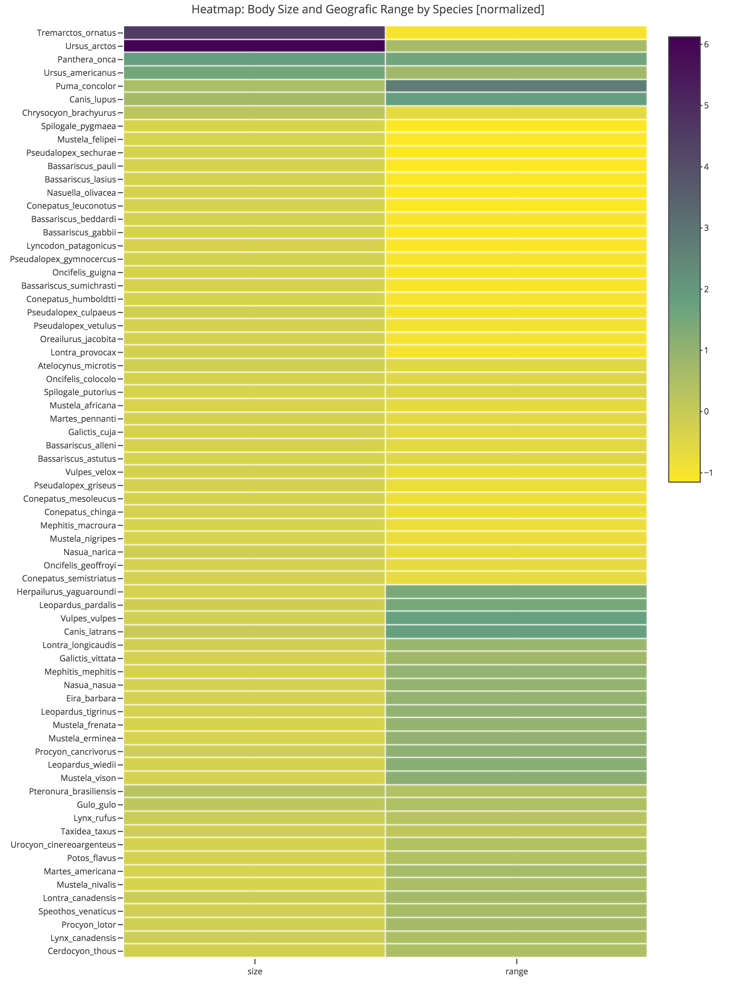

```{r setup, include=FALSE}

knitr::opts_chunk$set(fig.width = 7, fig.height = 4.5, echo = FALSE, 
                      warning = FALSE, message = FALSE) 

library(ape)
library(knitr)
library(lattice)

# The easiest way to get "phyloch" package is via
# install_github("fmichonneau/phyloch") more information can be found at
# http://www.christophheibl.de/Rpackages.html
# if you got the error saying incomplete final line blah blah
# open the file .Rprofile and put the curser at the very end and type enter, 
# save the file and try installing them again.

library(phyloch)

# Use this if BiocManager is not installed
#if (!requireNamespace("BiocManager", quietly = TRUE))
#    install.packages("BiocManager")
#library("BiocManager")

# BiocManager packages

################################################################################
# IMPORTANT
# Install ClustalW from http://www.clustal.org/download/current/
# Don't forget to add it to your PATH!
# Install MAFFT version 7 from https://mafft.cbrc.jp/alignment/software/
################################################################################


# For all ----------------------------------------------------------------------

library(dplyr)
library(tidyr)
library(magrittr)

# Question 2.1 -----------------------------------------------------------------
library(ade4)      # carni70 data set
library(plotly)    # Heatmap
library(seriation) # Ordering heatmap
library(ggplot2)   # All other plots
library(phylogram) # Phylogenetic tree visualization 
library(ggdendro)  # Phylogenetic tree visualization 

# Question 2.2 -----------------------------------------------------------------
library(ape)
library(mvMORPH)  
library(mvSLOUCH)
library(ouch)   
library(slouch) # devtools::install_github("https://github.com/kopperud/slouch")

```

# Assignment 1

Using the script <http://ape-package.ird.fr/APER/APER2/SylviaWarblers.R> obtain
the Sylvia warblers phylogeny (the script saves in the file
```sylvia_nj_k80.tre```). The geographical range data can be found in
<http://ape-package.ird.fr/APER/APER2/sylvia_data.txt> and in the script is
referenced as DF$geo.range. Notice that one tip is removed due to missing data.

```tr <- drop.tip(tr, "Chamaea_fasciata")```

and the data has to be ordered by the tips of the phylogeny

```DF <- sylvia.eco[tr$tip.label, ]```

**WARNING:** Running the script bare might result in errors and very long
running times.

**Choose only the lines that you actually need!**

## Task 1.1

**Question:** Explain all the steps in the script required to obtain the
phylogeny and trait data.

The keep it clean we keep track of everything as a bullet point list:

### Setup

- We moved all library imports to the top of our RMarkdown file
- Install ClustalW from http://www.clustal.org/download/current/
- Add ClustalW to the PATH variable of your system
- Install ```phyloch``` with ```install_github("fmichonneau/phyloch")```
  - <http://www.christophheibl.de/Rpackages.html>
- Install 'MAFFT' from <https://mafft.cbrc.jp/alignment/software/>
  - Use the ```path``` parameter to point to the executable OR
  - Add to PATH
- PhyML 3.0 must be installed
  - http://www.atgc-montpellier.fr/phyml/download.php
  - Point to the executable in the execpath arguments or add to PATH

### Script

```{r, eval = FALSE, results='hide'}
# ------------------------------------------------------------------------------
# Question 1.1
# ------------------------------------------------------------------------------

#source("SylviaWarblers.R")
# As we have to explain the code line by line we will not source it but paste it
# here do add comments.

###
### Chapter 3
###

# These line create a vector whioch contains 'Z73494' followed by 'AJ5345' with
# ascending numbers at the end ranging from 26 to 49. Then the GenBank database
# is searched and the result saved in 'sylvia.seq' which holds 25 results.
x <- paste("AJ5345", 26:49, sep = "")
x <- c("Z73494", x)
sylvia.seq <- read.GenBank(x)

# 'clustal()' alignes a set of nucletotide sequences. The programm ClustalW must
# be installed locally for this to work.
sylvia.clus <- clustal(sylvia.seq)

# MAFFT must be installed. For windows the easiest way is to point to the exe-
# cutable. As it's > 60MB of size, it's not included in the git repository.
# On Linux or macOS this might work out of the box, simply remove the 'path'
# argument.
# MAFFT is used for sequence and profile aligning. It seems like that both
# clustal and mafft return the same result.
sylvia.maff <- mafft(sylvia.seq)
# This function checks if two R objects are equal, which retruns TRUE, so our
# guess was correct.
#identical(sylvia.clus[x, ], sylvia.maff[x, ])

# Add's the attribute 'species' to a new object.
taxa.sylvia <- attr(sylvia.seq, "species")
# The names we mentioned above are assigned to this new object.
names(taxa.sylvia) <- names(sylvia.seq)
# This removes the previous object read from the GenBank.
rm(sylvia.seq)
# The first and the 24th entry get names.
taxa.sylvia[1] <- "Sylvia_atricapilla"
taxa.sylvia[24] <- "Sylvia_abyssinica"

# Now we read from the text file which was provided via a link.
# It holds the geographical range data.
# Note that we changed the name of the file.
sylvia.eco <- read.table("SylviaData.txt")
# Shows the structure of the importet data.frame. It has 26 obvervations and 3
# variables.
#str(sylvia.eco)
# Displays the rownames of the data.frame which are a bunch of names 'Sylvia_*'.
#rownames(sylvia.eco)
# We save the three objects to the file called 'sylvia.RData'.
# Note that we added an 'S' to 'sylvia.cluS' as it was misspelled.
save(sylvia.clus, taxa.sylvia, sylvia.eco,
     file = "sylvia.RData")

###
### Chapter 5
###

# These functions create a matrix of parwise distances from DNA sequences using
# a model of DNA evolution (taking from Help file).
# The calls also have the argument 'pairwise.deletion' which is set to TRUE.
# This deletes the sites with missing data in a pairwise way.
# The model parameter specifies which model is to be used. As 'K80' is the
# default model, this parameter is not specified for the first call.
# A description of the models can be found in the Help file.
syl.K80 <- dist.dna(sylvia.clus, pairwise.deletion = TRUE)
syl.F84 <- dist.dna(sylvia.clus, model = "F84", p = TRUE)
syl.TN93 <- dist.dna(sylvia.clus, model = "TN93", p = TRUE)
syl.GG95 <- dist.dna(sylvia.clus, model = "GG95", p = TRUE)

# This just plots a distance matrix and is not needed for saving the tree.
#round(cor(cbind(syl.K80, syl.F84, syl.TN93, syl.GG95)), 3)

syl.JC69 <- dist.dna(sylvia.clus, model = "JC69", p = TRUE)
syl.raw <- dist.dna(sylvia.clus, model = "raw", p = TRUE)

# The following code is used for more plotting which we don't need for obtaining
# the tree.
#layout(matrix(1:2, 1))
#plot(syl.JC69, syl.raw)
#abline(b = 1, a = 0) # draw x = y line
#plot(syl.K80, syl.JC69)
#abline(b = 1, a = 0)

#layout(matrix(1:3, 1))
#for (i in 1:3) {
#    s <- logical(3); s[i] <- TRUE
#    x <- sylvia.clus[, s]
#    d <- dist.dna(x, p = TRUE)
#    ts <- dist.dna(x, "Ts", p = TRUE)
#    tv <- dist.dna(x, "Tv", p = TRUE)
#    plot(ts, d, xlab = "Number of Ts or Tv", col = "blue",
#         ylab = "K80 distance", xlim = range(c(ts, tv)),
#         main = paste("Position", i))
#    points(tv, d, col = "red")
#}

#y <- numeric()
#for (i in 1:3) {
#    s <- logical(3); s[i] <- TRUE
#    y <- c(y, dist.dna(sylvia.clus[, s], p = TRUE))
#}
#g <- gl(3, length(y) / 3)

# Plots the histogram
#histogram(~ y | g, breaks = 20)

# The function nj is doing a neighbor-joining tree estimation
nj.sylvia.K80 <- nj(syl.K80)
nj.sylvia.GG95 <- nj(syl.GG95)

# dist.topo calculates the topological distance between two trees (12 here).
# It's not needed for saving the tree, so we uncomment it.
#dist.topo(nj.sylvia.K80, nj.sylvia.GG95)

# Just the unix command getting "Chamaea_fasciata"
#grep("Chamaea", taxa.sylvia, value = TRUE)
f <- function(xx) root(nj(dist.dna(xx, p=TRUE)), "AJ534526")
tr <- f(sylvia.clus)
## same than: tr <- root(nj.sylvia.K80, "AJ534526")
# nj.phylo analyse bipartitions found in series of trees (from documntation)
nj.boot.sylvia <- boot.phylo(tr, sylvia.clus, f, 200,
                             rooted = TRUE)
nj.boot.codon <- boot.phylo(tr, sylvia.clus, f, 200, 3,
                            rooted = TRUE)
nj.est <- tr
nj.est$tip.label <- taxa.sylvia[tr$tip.label]

# The plot is not needed
#plot(nj.est, no.margin = TRUE)
#nodelabels(round(nj.boot.sylvia / 200, 2), bg = "white")
#add.scale.bar(length = 0.01)

# Saves the tree to the file
write.tree(nj.est, "sylvia_nj_k80.tre")

# Writes 25 sequences to a file. Length is 1143.
write.dna(sylvia.clus, "sylvia.txt")

# Calls PhyML and fits 28 models of DNA evolution. They're saved to disk and
# in R returned as a vector. The log-likelihood is saved in this vector.
phyml.sylvia <- phymltest("sylvia.txt", execname = "/Users/flennic/Downloads/PhyML31")

# Again not needed for obtaining the tree
#summary(phyml.sylvia)
#plot(phyml.sylvia, col = "black")

# Read the tree from the txt.
TR <- read.tree("sylvia.txt_phyml_tree.txt")

# Adding some labels and descriptions to the tree
mltr.sylvia <- TR[[28]]
mltr.sylvia$tip.label <- taxa.sylvia[mltr.sylvia$tip.label]
mltr.sylvia <- root(mltr.sylvia, "Chamaea_fasciata")
#plot(mltr.sylvia, no.margin = TRUE)
#add.scale.bar(length = 0.01)

# The tip is dropped as explained in the exercise
tr.ml <- drop.tip(mltr.sylvia, "Chamaea_fasciata")
res <- vector("list", 9)

# The for loop takes some time. chronopl estimates the node ages of trees by
# using a semi-parametric method based on penalized likelihood (see docu-
# mentation).
for (L in -4:4)
    res[[L + 5]] <- chronopl(tr.ml, 10^L, 12, 16, CV = TRUE)
Lambda <- 10^(-4:4)
CV <- sapply(res, function(x) sum(attr(x, "D2")))
#plot(Lambda, CV / 1e5, log = "x")

# Add the attribute "rates" to the tree with 24 tips and 23 internal nodes
sylvia.chrono <- res[[2]]
rts <- attr(sylvia.chrono, "rates")
#summary(rts)

# Not needed for obtaining the tree
#par(mar = c(2, 0, 0, 0))
#plot(sylvia.chrono, edge.width = 100*rts, label.offset = .15)
#axisPhylo()

# Finally writes the tree to the file.
write.tree(sylvia.chrono, "sylvia.chrono.tre")

###
### Chapter 6
###

# Load the RData
load("sylvia.RData")
# Read the tree
nj.est <- read.tree("sylvia_nj_k80.tre")
# Drop the tip as mentioned in the exercise
nj.est <- drop.tip(nj.est, "Chamaea_fasciata")

# Get mig.dist, mig.behav and geo.range and safe if to DF
DF <- sylvia.eco[nj.est$tip.label, ]

# Create a table with the range and the behav, so its long, resid, short against
# temp, temptrop and trop
table(DF$geo.range, DF$mig.behav)

# Ace ist used to estimate the ancestral character states and the corresponding
# uncertainty (traits), the "d" defines that we're handeling discrete
# characters. Seond call changes the model, which is a numeric matrix
syl.er <- ace(DF$geo.range, nj.est, type = "d")
syl.sym <- ace(DF$geo.range, nj.est, type="d", model="SYM")
# Variance/Deviance for the fitted models (incl. Likelihood) and Chi Testing
#anova(syl.er, syl.sym)

mod <- matrix(0, 3, 3)
mod[2, 1] <- mod[1, 2] <- 1
mod[2, 3] <- mod[3, 2] <- 2

# Now we use the creates model to estimate again
syl.mod <- ace(DF$geo.range, nj.est, type="d", model=mod)

sapply(list(syl.er, syl.sym, syl.mod), AIC)

#Q <- syl.mod$index.matrix
#diag(Q) <- 0
#Q[1, 2] <- Q[2, 1] <- syl.mod$rates[1]
#Q[2, 3] <- Q[3, 2] <- syl.mod$rates[2]

#Q[] <- c(0, syl.mod$rates)[Q + 1]
#diag(Q) <- -rowSums(Q)

# THIS IS NOT WORKING AS WE HAVE NAs IN THE MATRIX
#P <- matexpo(0.05 * Q)
#rownames(P) <- c("temp", "temptrop", "trop")
#colnames(P) <- rownames(P)

# This works but do we need this?
#sylvia.chrono <- read.tree("sylvia.chrono.tre")
#yule(sylvia.chrono)
#birthdeath(sylvia.chrono)
#1 - pchisq(2*(-1.034112 - -1.113822), 1)

#x <- sylvia.eco[sylvia.chrono$tip.label, "geo.range"]
#ANC <- ace(x, sylvia.chrono, type = "d", model = mod)
#ANC$lik.anc[1:3, ]
#anc <- apply(ANC$lik.anc, 1, which.max)
#X <- factor(c(x, anc))
# This breaks as we have NAs!
#yule.cov(sylvia.chrono, ~ X)
#1 / (1 + exp(-(-0.0535529)))
#1 / (1 + exp(-(-0.0535529 -1.4608019)))
#1 / (1 + exp(-(-0.0535529 -0.9775966)))

#fsamp <- function(x) sample(length(x), size = 1, prob = x)
#nrep <- 1e3
#Pvls <- numeric(nrep)
#for (i in 1:nrep) {
#    anc <- apply(ANC$lik.anc, 1, fsamp)
#    X <- factor(c(x, anc))
#    Pvls[i] <- yule.cov(sylvia.chrono, ~ X)$Pval
#}
#hist(Pvls, freq = FALSE, main = "")
#lines(density(Pvls))

```

Here we have the phylogenetic tree of Sylvia:

```{r, eval = FALSE}
# That's the plot which is nice so we should leave it :)
co <- rep("grey", 24)
co[DF$geo.range == "temp"] <- "black"
co[DF$geo.range == "trop"] <- "white"
plot(nj.est, "c", FALSE, no.margin = TRUE, label.offset = 1)
tiplabels(pch = 22, bg = co, cex = 2, adj = 1)
nodelabels(thermo = syl.mod$lik.anc, cex = 0.8,
           piecol = c("black", "grey", "white"))
```


## Task 1.2

**Question:** Analyze the discrete (```type=discrete```) geographical range
variable (```DF$geo.range```) using ```ape::ace```.
Consider different models (parameter ```model```). Report on the results and interpret the estimated
rates and their standard errors..
  
  
Function ```ape::ace```  Ancestral Character Estimation, estimates ancestral
character states, and the associated uncertainty, for continuous or discrete
characters. For this question, we are analyzing the discrete geographical range
variable, there are 3 available model for type=discrete : "ER", "ARD", "SYM".
 - "ER" is an equal-rates model 
```{r, eval=FALSE}
ace(DF$geo.range,nj.est,type="discrete",model="ER")
#check R console
```
 - "ARD" is an all-rates-different model 
```{r, eval=FALSE}
ace(DF$geo.range,nj.est,type="discrete",model="ARD")
#check R console
```
 - "SYM" is a symmetrical model 
```{r, eval=FALSE}
ace(DF$geo.range,nj.est,type="discrete",model="SYM")
#check R console
```
  
# Assignment 2

## Task 2.1

We are given a data set about carnivores. The first task is to explore this data
set. Overall, it is a list consisting of a) a phylogenetic tree in Newick format 
and b) quantitative traits of the species in the tree. The quantitative traits 
consist of two variables, `size` (body size) and `range` (geographic range in km).
There are 70 species in total. The exploratory analyzis follows after the 
visualizations below.

```{r fig.height=4}

# ------------------------------------------------------------------------------
# Question 2, Task 1
# ------------------------------------------------------------------------------

# Data import ------------------------------------------------------------------

data("carni70")
df = carni70$tab   # quantitative traits
tree = carni70$tre # phylogenetic tree
rm(carni70)

# Create Plots -----------------------------------------------------------------

# Descriptive Statistics -------------------------------------------------------
knitr::kable(as.data.frame(round(psych::describe(df), 2)), 
             caption = "Descriptive Statistics of Quantitative Traits")

# Scatterplot of size by range -------------------------------------------------
ggplot(df, aes(range, size)) + geom_point(color = "skyblue3", alpha = 0.8) + 
  labs(title = "Scatterplot of Body Size (in kg) by Geographic Range (in km)", 
       y = "Body Size", x = "Geografic Range") +
  theme_bw() + theme(plot.title = element_text(hjust = 0.5))

# Density plots of size and range ----------------------------------------------
ggplot(df, aes(size)) + geom_density(fill = "skyblue3", alpha = 0.8) + 
  labs(title = "Density Plot of Body Size (in kg)", 
       y = "Density", x = "Body Size") +
  theme_bw() + theme(plot.title = element_text(hjust = 0.5))

cat("\n\n\n")

ggplot(df, aes(range)) + geom_density(fill = "skyblue3", alpha = 0.8) + 
  labs(title = "Density Plot of Geografic Range (in km)", 
       y = "Density", x = "Geografic range") +
  theme_bw() + theme(plot.title = element_text(hjust = 0.5))

# Heatmap of observation by size and range -------------------------------------
library(plotly) 
library(seriation)
df_scaled = scale(df)
rowdist=dist(df_scaled) 
set.seed(12345)
order=seriate(rowdist, "HC") 
ord=get_order(order) 
reordmatr=df_scaled[rev(ord),]

p = plot_ly(x=colnames(reordmatr), y=rownames(reordmatr), z=reordmatr, 
   type="heatmap", colors = ~rev(scales::viridis_pal(option = "viridris")(3)), 
   xgap = 1, ygap = 1) %>%
   layout(title = "Heatmap: Body Size and Geografic Range by Species [normalized]", 
          font = list(size = 8))

# CONVERTING PLOTLY OBJ. TO PNG (MAPBOX_TOKEN + orca INSTALLATION REQUIRED)
# Sys.setenv("MAPBOX_TOKEN" = "YOURTOKEN")
# plotly::orca(p, file = "images/heatmap.png", scale = 3, height = 950, width = 700)



# Scatterplot colored by clusters identified by heatmap ------------------------
df_cluster = data.frame(species = rev(rownames(reordmatr)), 
                        cluster = rep("outliers", nrow(reordmatr)), 
                        stringsAsFactors = FALSE)
df_cluster[7:41, "cluster"] = "cluster1"
df_cluster[42:nrow(df_cluster), "cluster"] = "cluster2"

df_plot = df
df_plot$species = rownames(df_plot)
df_plot %<>% left_join(df_cluster, by = "species")

# Scatterplot of size by range -------------------------------------------------
ggplot(df_plot, aes(range, size)) + geom_point(aes(color = cluster), alpha = 0.8)+ 
  labs(title = "Scatterplot with Clusters Identified from Heatmap", 
       y = "Body Size", x = "Geografic Range", color = "Cluster") +
  theme_bw() + theme(plot.title = element_text(hjust = 0.5))

```

**Exploratory Analysis: Main Findings [Quantitative Variables]**

*Scatterplot*

- It does not seem like `size` and `range` are correlated or non-linearly related.
- There is one upper-side outlier w.r.t. geographic range: Puma_concolour.
- There are two upper-side outliers w.r.t. body size: Ursus_arctos and Tremarctos_ornatus.

*Density Plot*

- Both quantitative variables, `size` and `range` are highly skewed to the right.
- `size` is much more skewed to the right than `range`.

*Heatmap*

- Two clusters can be identified. The species not belonging to these clusters are 
described as here.
    - Cluster 1: from Chrysocyon_brachyurus to Conepatus_semistriatus
    - Cluster 2: everything below Conepatus_semistriatus
    - Outliers: everything above Chrysocyon_brachyurus
- The clusters are mainly based on the `range` since both clusters have similar 
values w.r.t. `size`.
- The clusters found in the heatmap are visualized in a scatterplot again (using
the color aesthetic). We can see, that they are also cluster in the scatterplot.

**Exploratory Analysis: Main Findings [Tree]**

*Dendogram*

- The clusters identified in the heatmap do not (!) actually correspond to 
different branches in the dendogram.
- We can conlude that different species can have very similar traits w.r.t. `size` 
and `range` but still be different species.

```{r fig.height=10, fig.width=9}

# Tree Visualization -----------------------------------------------------------

# For reference: 
# https://cran.r-project.org/web/packages/phylogram/vignettes/phylogram-vignette.html
# http://www.sthda.com/english/wiki/beautiful-dendrogram-visualizations-in-r-5-must-known-methods-unsupervised-machine-learning

# converting tree to dendrogram (required for all alternatives below)
dnd = phylogram::read.dendrogram(text = tree) 

# # ALTERNATIVE 1: Ugly
# plot(dnd, yaxt = "n") 

# # ALTERNATIVE 2: Okay
# dnd %>% dendextend::set("labels_cex", 0.5) %>% plot 

# ALTERNATIVE 3: Nice
# ggdendrogram(dnd, rotate = TRUE, theme_dendro = FALSE) 

# ALTERNATIVE 4: Nice + Cluster Colors Specified
dnd_data = ggdendro::dendro_data(dnd) # converting dendrogram to data.frame
df_cluster$species = gsub("_", ".", df_cluster$species) # replace "_" by "."
dnd_data$labels %<>% left_join(df_cluster, by = c("label" = "species")) # join

ggdendrogram(dnd, rotate = TRUE, theme_dendro = FALSE, labels = FALSE) + 
  geom_text(data = dnd_data$labels, aes(x, y, label = label, color = cluster),
            hjust = 1, angle = 0, size = 3) + labs(x = "", y = "", 
       title = "Dendogram (Colored by Clusters identified from Heatmap)") +
  theme(plot.title = element_text(hjust = 0.5)) + theme_minimal() +
  scale_y_continuous(limits = c(-20, 65)) 

```

## Task 2.2

Here, we analyze the two quantitative traits (size and range) with a number of 
different phylogenetic comparative models. The following models are used:

1. Both traits evolve as independent Brownian motions.
2. The traits evolve as a correlated Brownian motion.
3. Both traits evolve as independent Ornstein–Uhlenbeck processes.
4. The traits evolve as a bivariate Ornstein–Uhlenbeck process (use mvMORPH or mvSLOUCH but be careful and check under what assumptions the estimation is done).
5. size evolves as a Brownian motion and range as an Ornstein–Uhlenbeck process adapting to it (use slouch or mvSLOUCH and be careful about column order).

```{r}

# ------------------------------------------------------------------------------
# Question 2.2
# ------------------------------------------------------------------------------

# 2.2.1
data("carni70")
tree = ape::read.tree(text = carni70$tre)  # Render the character a tree object
data_df = carni70$tab    # Extract the data keeping the data frame format
data_matrix = as.matrix(carni70$tab)   # Make it as matrix
tree_phylo = as.phylo(tree)   # Make it in the phylo format (probably not needed)
brownian_independent = mvBM(tree_phylo, data, model = "BM1", 
                            param = list(constraint = "diagonal"))
# With "BM1" we will have unique rate of evolution per trait
# with 'param = list(constraint = "diagonal")' we are forcing the independence 
# of the output (corr matrix with elements outside diagonal equal to zero)

# 2.2.2
tree_ouch =  ape2ouch(tree = tree)  # Function requires tree to be in the ouch format
# The default parameters will lead to correlated brownian automatically
brownian_correlated = BrownianMotionModel(tree_ouch, data_matrix)

# 2.2.3
# Asked to Krzysztof himself: you need to run separate algorithms in order to get
# independent univariate OU; apparently there is no other way
univariateOU_size = mvOU(tree_phylo, data_df$size, model = "OU1")
univariateOU_range = mvOU(tree_phylo, data_df$range, model = "OU1")

# 2.2.4
# NOTE: takes time!
multiOU = ouchModel(tree_ouch, data_matrix)

# 2.2.5
# The function consider the first kY columns of the data as Y (Ornstein–Uhlenbeck
# traits), while the remaining are considered to be the Xs (Brownian).
# In order to have "size" as Brownian and "range" as OU it is necessary to reorder
# the columns of the datarame before giving it to the fucntion.
reord_df = data_df[,c(2,1)]
multiOUBM = mvslouchModel(tree_ouch, reord_df, 1)

```


# Appendix

```{r, ref.label = knitr::all_labels(), echo = TRUE, eval = FALSE}

```