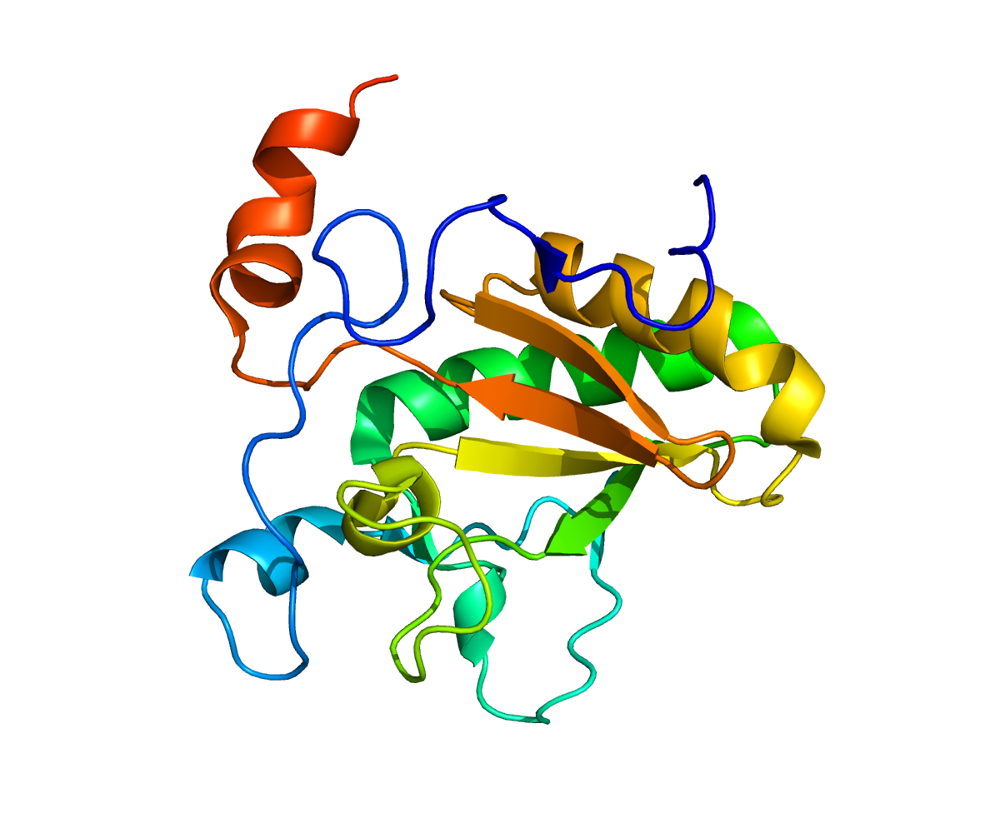

```{r setup, include=FALSE}

knitr::opts_chunk$set(fig.width = 7, fig.height = 5, echo = FALSE, 
                      warning = FALSE, message = FALSE) 

# All privided Links:
# R Bio: Untangling Genomes
# https://www.bioconductor.org/help/course-materials/ 2015/Uruguay2015/
# Step by Step HUVEC and OVE
# https://www.bioconductor.org/help/course-materials/2015/Uruguay2015/ day3-gene.expression.html 
# Cell Data:
# ftp://ftp.ncbi.nlm.nih.gov/geo/series/GSE20nnn/GSE20986/suppl/
# Description of Cell Data:
# https://www.ncbi.nlm.nih.gov/geo/query/acc. cgi?acc=GSE20986
# Additional
# https://www.bioconductor.org/help/course-materials/ 2015/Uruguay2015/day5-data_analysis.html
# Explanations Graphic
# https://www.bioconductor.org/help/course-materials/2015/Uruguay2015/V6-RNASeq.html

library(ggplot2)

# Use this if BiocManager is not installed
#if (!requireNamespace("BiocManager", quietly = TRUE))
#    install.packages("BiocManager")
#library("BiocManager")

# BiocManager packages
# BiocManager::install("GEOquery", version = "3.8")
# BiocManager::install("simpleaffy", version = "3.8")
# BiocManager::install("RColorBrewer", version = "3.8")
# BiocManager::install("affyPLM", version = "3.8")
# BiocManager::install("limma", version = "3.8")
# BiocManager::install("annotate", version = "3.8")
# BiocManager::install("hgu133plus2.db", version = "3.8")
library(GEOquery)
library(simpleaffy)
library(RColorBrewer)
library(affyPLM)
library(limma)
library(hgu133plus2.db)
library(annotate)

```

# Assignment 1

**Task:**

- Run all the R code and reproduce the graphics (https://www.bioconductor.org/help/course-materials/2015/Uruguay2015/day3-gene.expression.html)
- Go carefully through the R code and explain in your words what each step does.

**Data import**

First, we import the data corresponding to the GEO accession number GSE20986 
using the `getGEOSuppFiles()` function. We obtain a .tar file ("GSE20986_RAW.tar").
After extracting its contents, we obtain 12 .CEL.gz files. Consequently, these 
12 files are unzipped and the results are put into the `data` directory. The 
resulting 12 files are .CEL files (cell intensity files).

These files contain microarray data created by Affymetrix DNA microarray image 
analysis software. Recall that each set of microarray data contains light intensity
values, where high intensity corresponds to expressed genes and small intensity
to genes that were not expressed.

All the data comes from humans (Homo sapiens), from four different tissues:
iris, retina, choroid and human umbilical vein. There are three .CEL files per
tissue. 

References: 

- https://www.ncbi.nlm.nih.gov/geo/query/acc.cgi?acc=GSE20986
- https://www.ncbi.nlm.nih.gov/geo/geo2r/?acc=GSE20986
- https://fileinfo.com/extension/cel
- https://www.affymetrix.com/support/developer/powertools/changelog/gcos-agcc/cel.html
- https://bioconductor.org/help/course-materials/2009/SeattleApr09/AffyAtoZ/AffymetrixAtoZSlides.pdf

**Creating phenodata**

Before we are able to read in the data from all 12 files, we create a list with
three objects: The `Name` (for use in the resulting R object), the `FileName`
(for finding the corresponding .CEL file) and `Targets` which seems to be some
required meta data like the number of files. This list is then written as a .txt 
file. Finally, the function `read.affy()` from the `simpleaffy` package is called
to actually create the data to be used in R. This function takes phenodata.txt
as input to be able to find the .CEL files. The resulting object `celfiles` is
of class `AffyBatch` and contains the microarray data.

**Simple boxplot**

Now, we create a visualization of 12 boxplots, one for every .CEL file, using
`celfiles` as input. For this, we use the `boxplot` function from the 
`BiocGenerics` package. Unfortunately, the x-axis labels are not readable. 
Therefore, we don't know which boxplots belong to which .CEL file. Therefore, 
we create an improved boxplot visualization in the next step.

Note: Although light intensity values do have a unit, it does not really matter
for the interpretation. All we can do with the values is make relative comparisons
within one experiment. Higher values correspond to expressed genes. It is not 
possible whatsoever, to make comparisons across experiments because the scale
can differ. Furthermore, the scale is usually transformed (e.g. with logs), so
that absolute interpretations make even less sense.

Interpretation: As we can see, the majority of the light intensity values are 
between 5 and 7. However, there are also some very large light intensity values
which correspond to strongly expressed genes. The intensity values in the 
inter-quartile range (the rectangle boxes in the plots) may correspond to 
genes that are only expressed to a small extent (or maybe not even not at all).

```{r, echo = FALSE, eval = FALSE}
# ------------------------------------------------------------------------------
# Question 1
# ------------------------------------------------------------------------------

# Data import ------------------------------------------------------------------

# Get the Data
# x = getGEOSuppFiles("GSE20986")
# x

# Untar and Unzip
# DONT ADD THE FILE TO GIT IT'S 60MB!
# untar("GSE20986/GSE20986_RAW.tar", exdir = "data")
# cels = list.files("data/", pattern = "[gz]")
# sapply(paste("data", cels, sep = "/"), gunzip)

```

```{r fig.height=3.5}

# Creating phenodata -----------------------------------------------------------

# It's a matrix with two columns. Each row has the same entries in their cells,
# which is the filename. The first column is called 'Name' and the second one
# is called 'FileName'.
phenodata = matrix(rep(list.files("data", pattern = "[CEL]"), 2), ncol =2)

# class(phenodata) # "matrix"

phenodata = as.data.frame(phenodata)
colnames(phenodata) = c("Name", "FileName")
# Adding a new column with the target
phenodata$Targets = c("iris", 
                       "retina", 
                       "retina", 
                       "iris", 
                       "retina", 
                       "iris", 
                       "choroid", 
                       "choroid", 
                       "choroid", 
                       "huvec", 
                       "huvec", 
                       "huvec")

# Writes the dataframe to a .txt file
write.table(phenodata, "data/phenodata.txt", quote = F, sep = "\t",
            row.names = F)

# Now the data is read again and a boxplot is created
celfiles = simpleaffy::read.affy(covdesc = "phenodata.txt", path = "data")

# Simple box plot --------------------------------------------------------------

# Creates a boxplot for the log base 2 intensities including pm (perfect) and 
# mm (mismatch)
BiocGenerics::boxplot(celfiles)

```

**Improved boxplot**

We now create an improved box plot, in which the x-axis labels are readable.

Note: The colors do not have a special meaning. They do not e.g. correspond to a 
specific tissue. Instead, there are 8 color values which are used from left to 
right. After all 8 values have been used, the 1st color is used again, then the 
2nd color etc.

```{r fig.height=4}

# Improved box plot ------------------------------------------------------------

# Create "nice looking" color palettes. So this array actually has hex-color
# values inside.
cols = brewer.pal(8, "Set1")

# Help page: exprs, AffyBatch-method
# The columns are the different .CEL files and hold the data. It's a class re-
# presentation for the probe level data. The main component are the intensities
# from multiple arrays of the save CDF type.
eset = affy::exprs(celfiles)
samples = celfiles$Targets
# colnames(eset) # Print colnames

# The colnames are set to our targets
colnames(eset) = samples

# The .CEL files and their content is being plotted. It's basically the same
# plot as before but this time with fancy colors
par(mar=c(8,2,2,2)) # bottom, left, top and right margins
BiocGenerics::boxplot(celfiles, col = cols, las = 2)

```

**Cluster analysis (not normalized, tissue as labels)**

In the previous step, we have extracted the expression matrix (1354896 rows, 
12 columns) from the `celfiles` object which carries the data of all 12 .CEL 
files. Each row corresponds to a light intensity that tells us to what extend a 
gene is expressed (?). There are 12 columns, namely one for each cell intensity 
file.

Now, we compute a distance matrix for these 12 columns, using the 
`Chebyshev distance` as a metric. The `Chebyshev distance` gives us the maximum
difference between any pair of points in two vectors. Here, one vector 
corresponds to one of the 12 columns.

Subsequently, we conduct a hierarchical cluster analysis (HCA) on this distance 
matrix and plot the results in a cluster dendogram. Note that there are 12 leaf 
nodes in the plotted dendogram, each node corresponding to one .CEL file. The
labels tell us which tissue the .CEL file belonged to. 

Note that HCA is done by a stepwise procedure. At each step, the two columns with
the smallest dissimilarity are merged. We can therefore e.g. say that the 
bottom right leaf nodes (retina and retina) had a quite small dissimilarity. 
Also e.g. the 5th and 6th leaf nodes from the left (choroid and choroid) had a
quite small dissimilarity. After all, we can conclude that similarities between 
.CEL files of the same tissue were recognized. However, it is also clear that
similarities between different tissues were recognized (such as iris and choroid).

References: 

- https://bioconductor.org/help/course-materials/2009/SeattleApr09/AffyAtoZ/AffymetrixAtoZSlides.pdf
- https://stats.stackexchange.com/questions/209606/what-is-maximum-and-its-computation-in-the-function-dist-stats-in-r
- https://en.wikipedia.org/wiki/Chebyshev_distance
- https://stats.stackexchange.com/questions/82326/how-to-interpret-the-dendrogram-of-a-hierarchical-cluster-analysis
- http://www.econ.upf.edu/~michael/stanford/maeb7.pdf


```{r message = FALSE}

# Creating a distance matrix
distance = stats::dist(t(eset), method = "maximum")

# "Hierarchical cluster analysis on a set of dissimilarities and methods for analyzing it."
clusters = stats::hclust(distance)

# Plot the clusters in a tree diagram
# (https://en.wikipedia.org/wiki/Dendrogram)
plot(clusters)

```

**Box Plots with vs. without normalization**

The previous box plots (using the `celfiles` object of class `AffyBatch` as input)
were not based on normalized features. Here, we use the `gcrma()` function with 
`celfiles` as input to extract the object `celfiles.gcrma` of class `ExpressionSet`. 
When applying the `gcrma()` function, the default parameter `normalize` is set
to true. Therefore, we obtain normalized data.

Comparison: After normalizing, we can observe the following.

- Subtle differences in the inter-quartile ranges across samples (i.e. .CEL files)
get reduced. Almost all inter-quartile ranges look very similar in the 
`Post-Normalization` plot whereas they noticeably differ in the 
`Pre-Normalization` plot. 
- The medians decrease from values of around 6 to values of near 2.
- The upper quartile is much more spread out than the lower quartile in 
`Post-Normalization`. Likely, the lower quartiles correspond to genes that are
not expressed whereas the upper quartiles correspond to genes that are expressed.


```{r fig.height = 4.5, message = FALSE}

# Box Plots with vs. without normalization -------------------------------------

# "Robust Multi-Array expression measure using sequence infornmation"
# Converts an AffyBatch into an ExpressionSet by using RMA (robust multi-array)
# expression measure with the help of probe sequence
celfiles.gcrma = gcrma::gcrma(celfiles) # Biobase / ExpressionSet

# Two Boxplots showing different .CELS before and after normalization
par(mfrow=c(1,2), 
    mar=c(10,2,2,2)) # bottom, left, top and right margins
boxplot(celfiles.gcrma, col = cols, las = 2.5, cex.axis = 0.7, main = "Post-Normalization");
boxplot(celfiles, col = cols, las = 2.5, cex.axis = 0.7, main = "Pre-Normalization")

```

**Cluster analysis (normalized, .CEL names as labels)**

Here, we perform another cluster analyzis. This time, however, we use the 
normalized data, which we created for the box plot comparison above. We 
use the same distance metric for hierarchical clustering as before.

Again, we have 12 leaf nodes. However, the labels are now the names of the .CEL 
files (instead of their corresponding tissues). Still, we can see that the 
displayed dendogram differs from the dendogram that we received without 
normalization. This illustrates that normalization is indeed relevant here since 
it leads to different conclusions.

```{r}
# Turns of the "devices"
# dev.off()

# Create a distance matrix
distance = dist(t(exprs(celfiles.gcrma)), method = "maximum")

# Performs a hierachical cluster analysis.
clusters = hclust(distance)

# Plots the clusters, which is a Dendogram again
plot(clusters)
knitr::kable(phenodata, caption = "Phenodata")

```

**Linear Regression using Contrast Matrix**

First, we create a model matrix. It has four columns, one for each tissue, 
and twelve rows, one for each sample (i.e. .CEL file). Every row only has a
single `1` indicating which tissue the sample belongs to. The remaining columns
of every row are `0` since each .CEL file corresponds to only one tissue type.

Second, we create a contrast matrix (using the model matrix as input to provide
the tissue names). This  contrast matrix has 4 rows, one for each tissue, and 3 
columns, one for each contrast. The three contrasts are `huvec - choroid`, 
`huvec - retina` and `huvec - iris`. Basically, the `huvec` row contains
a value of `1` for all columns (since it is a minuend). The `choroid`, `retina` 
and `iris` rows have a value of `-1` in their corresponding contrast column 
(since they are subtrahends in the contrasts).

Third, we use the `lmFit()` function from the `limma` package. It takes
the normalized data in form of the `celfiles.gcrma` object of class 
`ExpressionSet` and it takes the model matrix `design` which specifies the 
contrasts that are supposed to be analyzed. The function fits a linear model to 
the expression data for each sample. According to the documentation, the 
coefficients of the fitted models describe the differences between the RNA 
sources hybridized to the arrays.

Fourth, we compute estimated coefficients and standard errors for a given set of 
contrasts, using the fitted model from the previous step. We also compute 
various statistics for these coefficients and standard errors such as
t-statistics, F-statistics and logodds. 

Finally, we print a summary of the results.

```{r}

# Create a model matrix
samples = as.factor(samples) # Factor of length 12 with tissue names
design = model.matrix(~0+samples) # Creates model matrix by expanding factors
colnames(design) # "sampleschoroid" "sampleshuvec"   "samplesiris"    "samplesretina"
colnames(design) = c("choroid", "huvec", "iris", "retina") # change colnames
knitr::kable(design, caption = "Design Matrix") # Print design matrix

# Create a contrast matrix from the model matrix
contrast.matrix = makeContrasts(huvec_choroid = huvec - choroid, 
                                huvec_retina = huvec - retina, 
                                huvec_iris = huvec - iris, 
                                levels = design)

# Fits a linear model for each gene given a series of arrays
# Results from the RMA and the contrast.matrix
fit = limma::lmFit(celfiles.gcrma, design)

# Use the model to fit microdata data (coefficients, errors)
huvec_fit = contrasts.fit(fit, contrast.matrix)

# Calculates t-statistics, F-statistics and logodds for the fitted data
huvec_ebay = eBayes(huvec_fit)

# Creates a list of probe name for 100000 entries. topTable takes the top-ranked
# genes from a linear fit
probenames.list = rownames(topTable(huvec_ebay, number = 100000))

# Get symbols
getsymbols = getSYMBOL(probenames.list, "hgu133plus2")

# And get the 100000 by the coefficient huvec_choroid
results = topTable(huvec_ebay, number = 100000, coef = "huvec_choroid")

# Add the symbols to this
results = cbind(results, getsymbols)

# Prints the summary of our results
summary(results)

# "Extract Data" depending on the p value and logFC
results$threshold = "1"
a = subset(results, adj.P.Val < 0.05 & logFC > 5)
results[rownames(a), "threshold"] = "2"
b = subset(results, adj.P.Val < 0.05 & logFC < -5)
results[rownames(b), "threshold"] = "3"

```

**Volcano plots**

https://en.wikipedia.org/wiki/Volcano_plot_(statistics)

## Assignment 2

**Task:**

- Present the variables versus each other original, log-scaled and MA-plot for each considered pair both before and after normalization.
- A cluster analysis is performed on the page but not report. Present plots and also draw heatmaps.

```{r}
# ------------------------------------------------------------------------------
# Question 2
# ------------------------------------------------------------------------------

```

# Assignment 3

**Task:**

- Provide volcano plots for the other pairs.
- Indicate significantly differentially expressed genes.
- Explain how they are found.

## Volcano Plots

### Huvec - Choroid

```{r, echo = FALSE}
# ------------------------------------------------------------------------------
# Question 3
# ------------------------------------------------------------------------------

significant_genes = c()

# ------------------------------------------------------------------------------
# Huvec - Choroid
# ------------------------------------------------------------------------------

current_genes = subset(results, logFC > 5 & -1*log10(adj.P.Val) > 5)
significant_genes = c(significant_genes, as.vector(current_genes$getsymbols))

table(results$threshold)

# Make a volcano plot
volcano = ggplot(data = results, 
                  aes(x = logFC, y = -1*log10(adj.P.Val), 
                      colour = threshold, 
                      label = getsymbols))
volcano = volcano + 
  geom_point() + 
  scale_color_manual(values = c("black", "red", "green"), 
                 labels = c("Not Significant", "Upregulated", "Downregulated"), 
                 name = "Key/Legend")
volcano + 
  geom_text(data = subset(results, logFC > 5 & -1*log10(adj.P.Val) > 5),
            aes(x = logFC, y = -1*log10(adj.P.Val), colour = threshold,
                label = getsymbols))

```

### Huvec - Retina

```{r, echo = FALSE}
# These are the other combinatin where we need volcano plots for
# huvec_retina
# huvec_iris

# ------------------------------------------------------------------------------
# Huvec - Retina
# ------------------------------------------------------------------------------

results = topTable(huvec_ebay, number = 100000, coef = "huvec_retina")
results = cbind(results, getsymbols)

current_genes = subset(results, logFC > 5 & -1*log10(adj.P.Val) > 5)
significant_genes = c(significant_genes, as.vector(current_genes$getsymbols))

results$threshold = "1"
a = subset(results, adj.P.Val < 0.05 & logFC > 5)
results[rownames(a), "threshold"] = "2"
b = subset(results, adj.P.Val < 0.05 & logFC < -5)
results[rownames(b), "threshold"] = "3"
table(results$threshold)

# Make a volcano plot
volcano2 = ggplot(data = results, 
                  aes(x = logFC, y = -1*log10(adj.P.Val), 
                      colour = threshold, 
                      label = getsymbols))

volcano2 = volcano2 + 
  geom_point() + 
  scale_color_manual(values = c("black", "red", "green"), 
                 labels = c("Not Significant", "Upregulated", "Downregulated"), 
                 name = "Key/Legend")

volcano2 + 
  geom_text(data = subset(results, logFC > 5 & -1*log10(adj.P.Val) > 5),
            aes(x = logFC, y = -1*log10(adj.P.Val), colour = threshold,
                label = getsymbols))

```

### Huvec - Iris

```{r, echo = FALSE}

# ------------------------------------------------------------------------------
# Huvec - Iris
# ------------------------------------------------------------------------------

results = topTable(huvec_ebay, number = 100000, coef = "huvec_iris")
results = cbind(results, getsymbols)

current_genes = subset(results, logFC > 5 & -1*log10(adj.P.Val) > 5)
significant_genes = c(significant_genes, as.vector(current_genes$getsymbols))

results$threshold = "1"
a = subset(results, adj.P.Val < 0.05 & logFC > 5)
results[rownames(a), "threshold"] = "2"
b = subset(results, adj.P.Val < 0.05 & logFC < -5)
results[rownames(b), "threshold"] = "3"
table(results$threshold)

# Make a volcano plot
volcano2 = ggplot(data = results, 
                  aes(x = logFC, y = -1*log10(adj.P.Val), 
                      colour = threshold, 
                      label = getsymbols))

volcano2 = volcano2 + 
  geom_point() + 
  scale_color_manual(values = c("black", "red", "green"), 
                 labels = c("Not Significant", "Upregulated", "Downregulated"), 
                 name = "Key/Legend")

volcano2 + 
  geom_text(data = subset(results, logFC > 5 & -1*log10(adj.P.Val) > 5),
            aes(x = logFC, y = -1*log10(adj.P.Val), colour = threshold,
                label = getsymbols))

```

## Significantly Differentially Expressed Genes

We observe the following differentially expresses genes:

```{r, echo = FALSE}

significant_genes = unique(significant_genes)
significant_genes = significant_genes[!is.na(significant_genes)]
print(significant_genes)

```

## Explanation How They Are Found

A volcano plot prints significance against fold-change. A fold-change is a measurement between two variables and is used as a measurement between how much they changed during measurements. So if we put on those values on the y- and x-axis we will get a view of the statistical signifiance and the magnitude of the a change. This enables the viewers to quickly recognize not only significant, but also "strong influencing" genes.

Therefore we have the ```log2``` of the fold-change on the x-axis and the ```-log10``` of the p-value on the y-axis. Thus interesting data points are those which are far to the top (p-value) and far to the left or right (significant change in the fold-change). In this one we can observe another feature of the data expressed in color. Here it is the regulation of the data.

The datapoints (genes) we obtained are those which are far to the right and in the upper part of the volcano plot. We used the provided code filtering those and adding the names to them as the seperator. All obtained genes are genes which are upregulated.

\newpage

# Assignment 4

**Task:**

- Try to find more information on the genes that are reported to be significantly differentially expressed. Report in your own words on what you find.
- Report all the Gene Ontology (GO) terms associated with each gene.
  - Are any of the GO terms common between genes?
  - If so do the common GO terms seem to be related to anything particular?
- Try to present GO analysis in an informative manner, if possible visualize.

## More Information About The Genes

**Comment:** Most information is taken from GeneCards and Wikipedia, the figures
are all taken from Wikipedia. We tried to describe the genes in our own words,
but some descriptions are so bio heavy in their expression that we just quoted
them as we are not sure how to deliver the same and correct amounf of 
information in our own words.

### HOXB7
The full name of this gene is *Homeobox protein Hox-B7* and is a member of the
Antp homeobox family. The homebox family is a cluster of genes which are used
during the early embryological development. This family is interesting to
inspect due to the fact that their sequences are conserved and widely used by
living taxa. The whole homobox family is part of the human genome.

This gene is member of the homobox B cluster and found on chromosome 17.

> The encoded nuclear protein functions as a sequence-specific transcription
> factor that is involved in cell proliferation and differentiation. Increased
> expression of this gene is associated with some cases of melanoma and ovarian
> carcinoma.

From: <https://www.ncbi.nlm.nih.gov/gene?Db=gene&Cmd=ShowDetailView&TermToSearch=3217>

<https://www.genecards.org/cgi-bin/carddisp.pl?gene=HOXB7>

{width=250px}

### IL1RL1
The full name if this gene is *Interleukin 1 receptor-like 1* and is a member of
the Toll-like receptor which are a part of the innate immune system. It is found
on chromosome 2 and is 40,536 bases long and encodes a protein of 556 amino 
acids. It seems to be important for T helper cells type 2.

<https://www.genecards.org/cgi-bin/carddisp.pl?gene=IL1RL1>


### HOXA5
*Homeobox protein Hox-A5* is part of the A cluster on chromosome 7 and
"encodes a DNA-binding transcription factor which may regulate gene expression,
morphogenesis, and differentiation." (from: <https://www.ncbi.nlm.nih.gov/gene/3202>).
It's possible that this gene plays a role in tumorigenesis. It upregulates the
tumor suppressor p53 which is also used as en example in the Book "Concepts in 
Bioinformatics and Genomics."

<https://www.genecards.org/cgi-bin/carddisp.pl?gene=HOXA5>

{width=250px}

### HOXB6
*Homeobox protein Hox-B6* is found in a cluster of the homobox B genes also on
chromosome 17. It's involved in the development of long, skin and has been
localized in nucleus as well as in cytoplasm.

<https://www.genecards.org/cgi-bin/carddisp.pl?gene=HOXB6>

{width=250px}

### GABBR2
*Gamma-aminobutyric acid (GABA) B receptor, 2 (GABAB2)* is a G-Protein, also
called GPCR which is a family of proteins. They're also called "seven-transmembrane
receptors" as they pass through the cell membrane seven times.

GABBR2 build some kind of messenger system for B-type receptors which inhibit
neural activity. These messenger systems regulate the release of neurotransmitters
and the activity of ion channels.

<https://www.genecards.org/cgi-bin/carddisp.pl?gene=GABBR2>

{width=250px}

### SOCS2
*Suppressor of cytokine signaling 2* is found on chromosome 12 and if part of the
SOCS family of proteins which are a port of the feedback system that regulates
signal transduction. It seems to be a negative regulator.

Diseases associated with SOCS2 are Essential Thrombocythemia and Vertebral Artery Occlusion.

<https://www.genecards.org/cgi-bin/carddisp.pl?gene=SOCS2>

{width=250px}

### CCNK
*Cyclin-K* is found on chromosome 14 and is a member of the transcription cyclin family.

> These cyclins may regulate transcription through their association with and
> activation of cyclin-dependent kinases (CDK) that phosphorylate the C-terminal
> domain (CTD) of the large subunit of RNA polymerase II. This gene product may
> play a dual role in regulating CDK and RNA polymerase II activities.

<https://www.genecards.org/cgi-bin/carddisp.pl?gene=CCNK>

{width=250px}

### SERPIND1
*Heparin cofactor II (HCII)* is found on chromosome 22 and belongs to the serpin
gene superfamily. They play a role in processes like inflammation, blood clotting, 
and cancer metastasis. SERPIND1 is a Protein Coding gene.

<https://www.genecards.org/cgi-bin/carddisp.pl?gene=SERPIND1>

{width=250px}

### DHH
*Desert hedgehog homolog* is a member of the hedgehog family which encodes signaling
molecules that regulate morphogenesis. It is located on chromosome 12 and may
be involved in gonadal differentiation and perineurial development.

<https://www.genecards.org/cgi-bin/carddisp.pl?gene=DHH>

{width=250px}

### GBGT1
*Globoside alpha-1,3-N-acetylgalactosaminyltransferase 1* is located on chromosome
9 and encodes for a member of the histo-blood group ABO gene family.

> expression of this protein may determine host tropism to microorganisms.
> Alternative splicing results in multiple transcript variants

<https://www.genecards.org/cgi-bin/carddisp.pl?gene=GBGT1>

{width=250px}

### RASGRF2
*Ras-specific guanine nucleotide-releasing factor 2* is located on chromosome 5
and variations of it seem to be related to propensity to binge drink by teenagers.

> Functions as a calcium-regulated nucleotide exchange factor activating both Ras
> and RAC1 through the exchange of bound GDP for GTP.

<https://www.genecards.org/cgi-bin/carddisp.pl?gene=RASGRF2>


## Gene Ontology Terms

Order of information: GO ID 	Qualified GO term 	Evidence 	PubMed IDs

### HOXB7

- GO:0000978 	RNA polymerase II proximal promoter sequence-specific DNA binding 	IDA 	8756643
- GO:0000981 	RNA polymerase II transcription factor activity, sequence-specific DNA binding 	ISA 	
- GO:0001077 	transcriptional activator activity, RNA polymerase II proximal promoter sequence-specific DNA binding 	IDA 	8756643
- GO:0003677 	DNA binding 	IEA 	
- GO:0003700 	DNA binding transcription factor activity 	NAS 	1678287

### IL1RL1

- GO:0002113 	interleukin-33 binding 	IEA 	
- GO:0002114 	interleukin-33 receptor activity 	IEA 	
- GO:0004896 	cytokine receptor activity 	TAS 	10191101
- GO:0004908 	interleukin-1 receptor activity 	IEA 	
- GO:0005057 	obsolete signal transducer activity, downstream of receptor 	TAS 	

### HOXA5

- GO:0000978 	RNA polymerase II proximal promoter sequence-specific DNA binding 	IDA 	10879542
- GO:0000981 	RNA polymerase II transcription factor activity, sequence-specific DNA binding 	NAS 	19274049
- GO:0001077 	transcriptional activator activity, RNA polymerase II proximal promoter sequence-specific DNA binding 	IDA 	10879542
- GO:0003677 	DNA binding 	IDA 	8657138
- GO:0003700 	DNA binding transcription factor activity 	IDA 	10879542

### HOXB6

- GO:0000981 	RNA polymerase II transcription factor activity, sequence-specific DNA binding 	NAS 	19274049
- GO:0003677 	DNA binding 	IEA 	
- GO:0003700 	DNA binding transcription factor activity 	IEA 	
- GO:0003723 	RNA binding 	HDA 	22681889
- GO:0005515 	protein binding 	IPI 	25416956

### GABBR2

- GO:0005737 	cytoplasm 	IEA 	
- GO:0005886 	plasma membrane 	TAS 	
- GO:0005887 	integral component of plasma membrane 	IDA,TAS 	9872316
- GO:0016020 	membrane 	IEA 	
- GO:0016021 	integral component of membrane 	IEA 	

### SOCS2

- GO:0004860 	protein kinase inhibitor activity 	IBA 	
- GO:0005070 	SH3/SH2 adaptor activity 	TAS 	9344848
- GO:0005131 	growth hormone receptor binding 	NAS 	12135564
- GO:0005159 	insulin-like growth factor receptor binding 	IPI 	9727029
- GO:0005515 	protein binding 	IPI 	11781573

#### CCNK

- GO:0004674 	protein serine/threonine kinase activity 	TAS 	
- GO:0004693 	cyclin-dependent protein serine/threonine kinase activity 	IDA 	9632813
- GO:0005515 	protein binding 	IPI 	16189514
- GO:0008353 	RNA polymerase II carboxy-terminal domain kinase activity 	IDA 	9632813
- GO:0016538 	cyclin-dependent protein serine/threonine kinase regulator activity 	IBA

### SERPIND1

- GO:0004866 	endopeptidase inhibitor activity 	TAS 	2647747
- GO:0004867 	serine-type endopeptidase inhibitor activity 	IBA 	
- GO:0008201 	heparin binding 	IEA 	
- GO:0030414 	peptidase inhibitor activity 	IEA

### DHH

- GO:0005113 	patched binding 	IEA 	
- GO:0005509 	calcium ion binding 	IDA 	19561611
- GO:0005515 	protein binding 	IPI 	19561611
- GO:0008233 	peptidase activity 	IEA 	
- GO:0008270 	zinc ion binding 	IDA 	19561611

### GBGT1

- GO:0016740 	transferase activity 	IEA 	
- GO:0016757 	transferase activity, transferring glycosyl groups 	IBA,IEA 	
- GO:0016758 	transferase activity, transferring hexosyl groups 	IEA 	
- GO:0046872 	metal ion binding 	IEA 	
- GO:0047277 	globoside alpha-N-acetylgalactosaminyltransferase activity 	IBA 	

### RASGRF2

- GO:0005085 	guanyl-nucleotide exchange factor activity 	TAS,IEA 	
- GO:0005088 	Ras guanyl-nucleotide exchange factor activity 	TAS,IMP 	
- GO:0005089 	Rho guanyl-nucleotide exchange factor activity 	IEA,TAS 	
- GO:0005515 	protein binding 	IEA 	
- GO:0005516 	calmodulin binding 	IEA 	

### Gene Ontology Analysis

```{r}
# ------------------------------------------------------------------------------
# Question 4
# ------------------------------------------------------------------------------

```


# Appendix

```{r, ref.label = knitr::all_labels(), echo = TRUE, eval = FALSE}

```