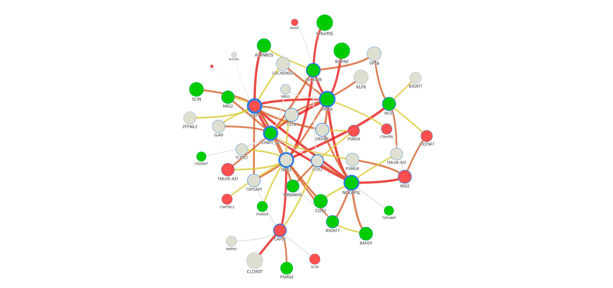
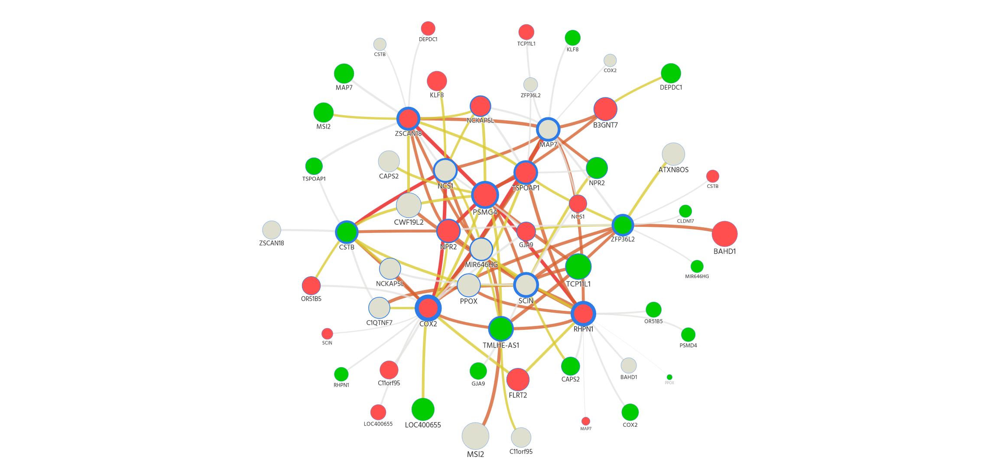

```{r setup, include=FALSE}

knitr::opts_chunk$set(fig.width = 7, fig.height = 3, echo = FALSE, 
                      warning = FALSE, message = FALSE) 

#install.packages("devtools")
library(devtools)
install_github("mategarb/R.ROSETTA")
library(R.ROSETTA)
library(plyr)
library(knitr)

```

# Task 1

**Task:**

- Install Packages

# Task 2

**Task:** The sample data is stored in the workspace as autcon.

- Inspect the dataset and describe it.
- What is the number of features? What is the number of objects in each class?

**Description:**

- The number of features is 35  (excluding `decision`, the target variable, which
is not a feature). All of them are numeric and represent genes.
- The number of rows is 146. Each row represents one male children with autism 
and healthy ones. There are 82 autistic boys and 64 control observations. This 
seems like a good enough balance of observations from both classes.

```{r, echo = FALSE}

cat("Number of features:  ", ncol(autcon)-1, "\n")
cat("Number of observations:  ", nrow(autcon), "\n")
cat("Number of obs. by class:  \n")
table(autcon$decision)

```

# Task 3

```{r, echo = FALSE}
# ------------------------------------------------------------------------------
# Task 3
# ------------------------------------------------------------------------------

autconDefault = rosetta(autcon)
rule_table = autconDefault$main
quality_statistics = autconDefault$quality


```

**Task:** Run ```rosetta()``` on the default parameters: ```autconDefault = rosetta(autcon)```

Use ```autconDefault$main``` to retrieve the rule table information, assign the result to a
separate table. Use ```autconDefault$quality``` and display the quality statistics of the
model:

  a. Define what is cross-validation. How many cross-validations are performed in
  ```rosetta``` by default?
  b. What is the default reduction method? What is it used for?
  c. What is the default method of discretization? Describe it shortly. How many
  discretization bins are calculated?
  d. What is the accuracy of the model?
  e. How many rules do you obtain? Print the top three most significant rules. Which
  class get more significant rules? You can assume the rule to be significant if the
  p-value (PVAL) is lower than 0.05.
  
## a)

## b)
The default reduction method is Johnson. Different reducer methods are: 
Johnson, Genetic, Holte1R or Manual.

This describes the preparation, not the actual method.
> The reduction method is used for finding the minimal subsets which preserves indiscernibility
> between the samples. It is basically finding dependencies in the data.
> So we're not looking for every combination of features but only at the combinations
> that we actually find in the data.

## c)
The default is `EqualFrequency`. It is used to transform continuous functions or data
into discrete parts, also called bins. `EqualFrequency` divides the data into
groups where each group has roughly the same size in terms of data-points/samples
per bin. A method for finding the best number of bins is creating a histogram and
using this the guess a good number.

For more information <http://www.uta.fi/sis/tie/tl/index/Datamining6.pdf>.

## d)
The accuracy can be taken from the confusion matrix which shows the four classifications:
- control as control (TP)
- control as autism (FP)
- autism as control (FN)
- autism as autism (TN)

The accuracy is calculated by: (TP+TN)/(TP+TN+FP+FN).

It basically tells us the misclassification rate of our model and the $\alpha$
and $\beta$ errors made.

## e)

```{r, echo = FALSE}

cat("We got", nrow(rule_table), "rules.")
knitr::kable(head(rule_table[order(rule_table$PVAL),], 3), 
             caption = "Top 3 Significant Rules")
#kable(autconDefault$rules[1:3])

rule_table_sub = rule_table[which(rule_table$PVAL < 0.05), ]
table(rule_table_sub$DECISION)

```


# Task 4

**Task:** Export the rules to a text file using the ```saveLineByLine()``` function.

```{r, echo = FALSE}

saveLineByLine(autconDefault$main, "outFile.txt")

```


# Task 5

**Task:** Choose further options: Use the VisuNet tool at <http://bioinf.icm.uu.se/~visunet/.> Upload your rules.

> File format Choose: "Line by line"
> Minimum Accuracy Default is 0.7, which means that rules with at least 70% accuracy will
> be used for displaying a network.
> Minimum Support Default is 1, which means all rules will be included in the network.
> You can toggle that and see the effects on the network.
> Threshold (%) Keep it 100
> Show top n nodes Leave it blank
> Color of nodes Choose: "Level of the gene expression"
> Is this gene data? Yes. Use the autism_annot.txt file

Submit the file to generate a rule-based network. On the left side, there is "Information Bar" where you can select the decision. By clicking on a node, you will be able to see:

  a. In the bottom panel: the rules that have the node as one of its conditions.
  b. On the right-hand side in the "Selected Node/Edge Info": the name of the node,
  the number of edges it has, the mean accuracy value and the mean support value.
  Furthermore, there is information about KEGG Pathways and GO annotations
  related with the node.
  




# Task 6

Export the networks for the autism and control decisions. Investigate connections
present on the networks. Find the strongest connections and the most significant nodes
for each decision. Try to interpret these in the context of autism related genes.
Hints: Calcium homeostasis is altered in autism disorders (Palmieri et al., 2010). The
autism dataset includes a group of genes related to a calcium ion binding (GO:0005509).
Take a closer look at SCIN, NCS1 and CAPS2.
You may also use the SFARI GENE database containing information about
autism-related genes: <https://gene.sfari.org/>
  
- Node size : mean support value
- Node color : expression value - green(low), grey(medium), red(high)
- Node border : number of rules
  
###For control
######The most significant node : MAP7
- Name : MAP7=3
- Edges: 16
- Connection: 224.4915
- Mean accuracy: 0.931
- Mean support: 14.875
  
######The strongest connection : MAP7=3 - NCKAP5L=1 (conn: 38.3052)

######The most significant node and SCIN, NCS1 and CAPS2
```{r}
table <- data.frame(From = c("MAP7","MAP7","MAP7")
                    ,To = c("SCIN","NCS1","CAPS2")
                    ,Support = c(16,"-","-")
                    ,Accuracy =c(0.94689,"-","-") )
table
```
  
#######Between SCIN, NCS1 and CAPS2
```{r}
table <- data.frame(From = c("NCS1","NCS1","SCIN")
                    ,To = c("CAPS2","SCIN","CAPS2")
                    ,Support = c("-","-","-")
                    ,Accuracy =c("-","-","-") )
table
```

###For autism
######The most significant node : COX2
- Name: COX2=3
- Edges: 19
- Connection: 318.58136
- Mean accuracy: 0.994
- Mean support: 16.15
  
######The strongest connection : PSMG4=3 - RHPN1=3 (conn: 40.09068)
COX2=3 - NCS1=2 (conn: 40)
  
######The most significant node and SCIN, NCS1 and CAPS2
```{r}
table <- data.frame(From = c("COX2","COX2","COX2")
                    ,To = c("SCIN","NCS1","CAPS2")
                    ,Support = c(8,20,"-")
                    ,Accuracy =c(1,1,"-"))
table
```
#######Between SCIN, NCS1 and CAPS2
```{r}
table <- data.frame(From = c("NCS1","NCS1","SCIN")
                    ,To = c("CAPS2","SCIN","CAPS2")
                    ,Support = c(14,13,14)
                    ,Accuracy =c(1,1,1))
table
```

# Appendix

```{r, ref.label = knitr::all_labels(), echo = TRUE, eval = FALSE}

```